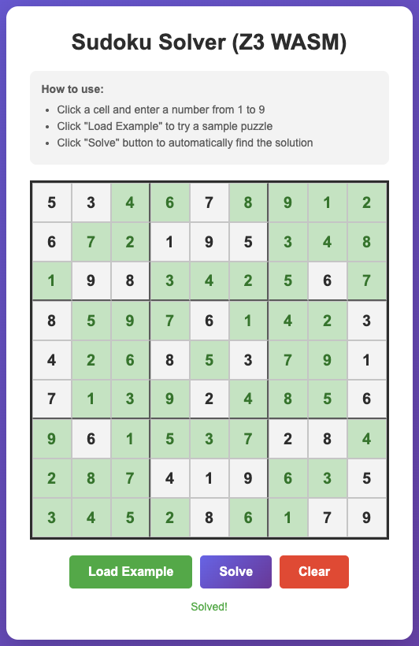

# A Sudoku solver using Z3 compiled to WASM

A browser-based Sudoku solver using the Z3 theorem prover compiled to WebAssembly.

**Live Demo:** <https://msakai.github.io/sudoku-z3-wasm/>

<p align="center">
  
</p>

## Requirements

- Node.js >= 16

## Setup

```bash
npm install
```

## Usage

### Development

```bash
npm run copy-assets
npm run dev
```

Open http://localhost:5173/ in your browser.

### Production Build

```bash
npm run build
npm run preview
```

The build process automatically copies Z3 WASM files and coi-serviceworker to the output directory.

## Deployment

### GitHub Pages

This project is configured for automatic deployment to GitHub Pages via GitHub Actions.

1. Enable GitHub Pages in repository settings (Settings > Pages > Source: "GitHub Actions")
2. Push to the `main` branch
3. The workflow automatically builds and deploys to <https://msakai.github.io/sudoku-z3-wasm/>

**Note:** GitHub Pages cannot set custom HTTP headers. The app uses [coi-serviceworker](https://github.com/gzuidhof/coi-serviceworker) to inject the required COOP/COEP headers client-side, enabling `SharedArrayBuffer` for Z3. On the first visit, the page will reload once as the service worker registers.

## File Structure

```
sudoku-z3/
├── index.html              # Main HTML with UI and script loaders
├── package.json            # Dependencies (z3-solver, vite, coi-serviceworker)
├── vite.config.js          # Vite config with COOP/COEP headers and base path
├── .github/workflows/
│   └── deploy.yml          # GitHub Actions workflow for GitHub Pages
├── public/                 # Static files (copied during build)
│   ├── coi-serviceworker.js # Service worker for COOP/COEP headers
│   ├── z3-built.js         # Z3 WASM loader
│   └── z3-built.wasm       # Z3 WASM binary (~33MB)
└── src/
    ├── main.js             # UI and grid management
    └── solver.js           # Sudoku solver using Z3
```

## How It Works

The Sudoku puzzle is encoded as a constraint satisfaction problem and solved using Z3:

- Each cell is an integer variable constrained to values 1-9
- Each row must have distinct values
- Each column must have distinct values
- Each 3x3 block must have distinct values
- Initial values are fixed as additional constraints

## Notes

- Z3-solver requires `SharedArrayBuffer`, which needs special HTTP headers (COOP/COEP):
  - For local development, Vite serves these headers automatically.
  - For GitHub Pages, coi-serviceworker injects the headers via a service worker.
- The `z3-built.js` must be loaded via a script tag before the module imports, as it sets up `window.initZ3` required by z3-solver.
- The `coi-serviceworker.js` must be loaded before `z3-built.js` to ensure headers are set first.
